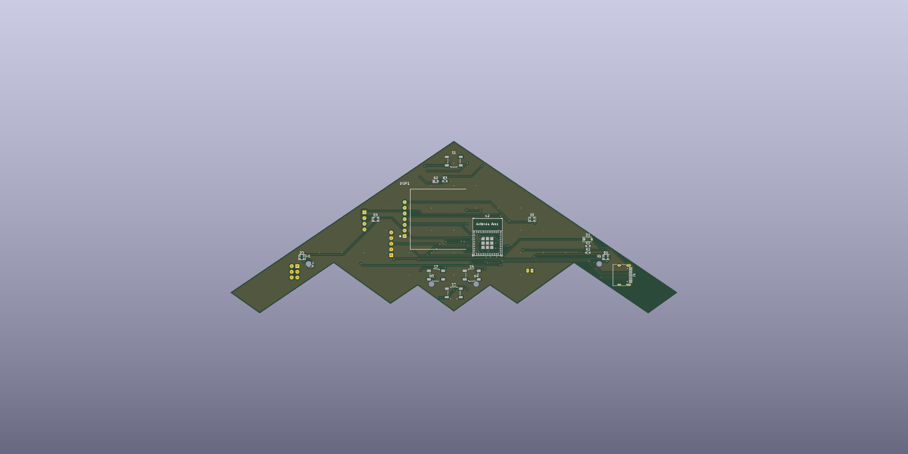
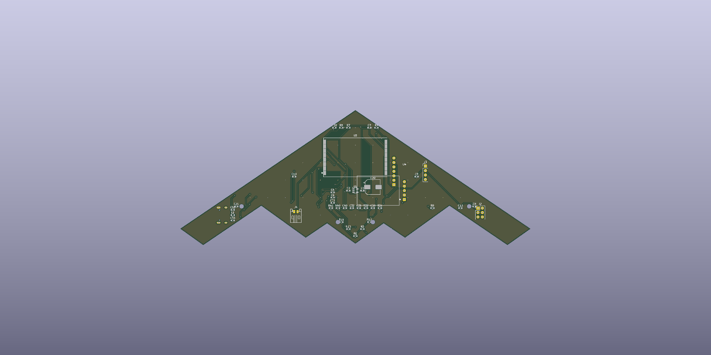
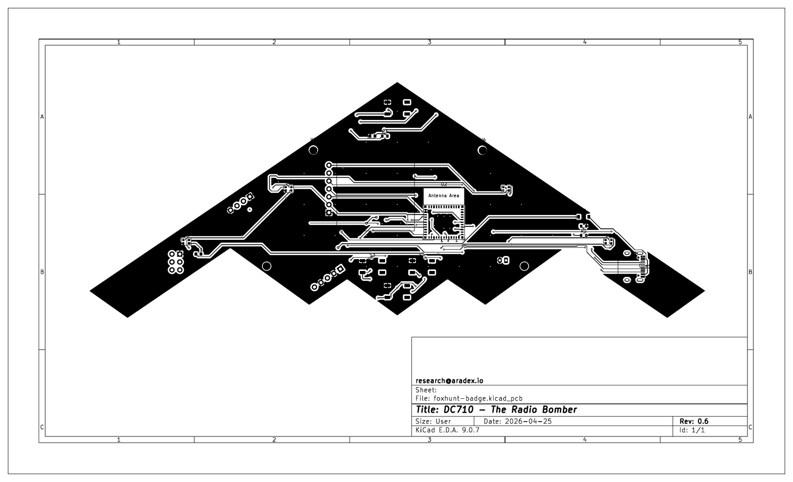
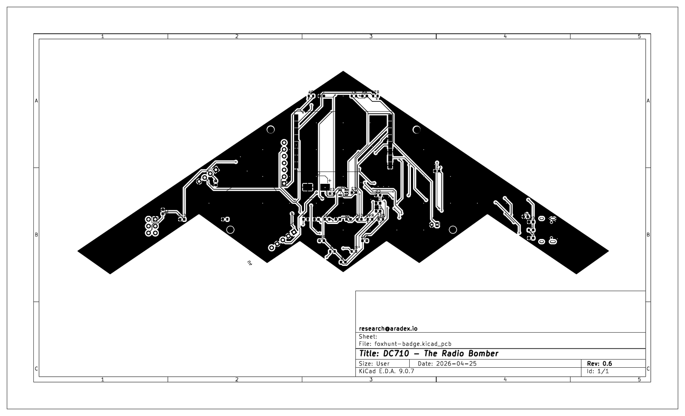

# DC710 Badge — DEF CON 34 (B-2 Spirit)

Flying-wing PCB badge in a real B-2 Spirit silhouette.  ESP32-C3 +
SA868-V VHF transceiver, single-cell LiPo, USB-C charging, OLED display,
4× WS2812 RGB LEDs, 3× tactile buttons, SAO header.

**Board:** 200 × 77 mm (≈ 7.87" tip-to-tip), real B-2 proportions
(wingspan/length ≈ 2.5).  Outline extracted from a real B-2 STL mesh —
3 aft-pointing spikes, engine-cutout notches, sharp swept wingtips.

### 3D render — Top (F.Cu)

### 3D render — Bottom (B.Cu)

### Official blueprint — Front

### Official blueprint — Back

---

## What's in the project

### Hardware
- **MCU:** ESP32-C3-MINI-1 module (official Espressif footprint, 53 pads)
- **Radio:** G-NiceRF SA868-V VHF (134–174 MHz) walkie-talkie module
- **Display:** SSD1306 0.96" OLED, 7-pin SPI
- **Power:** USB-C → SS14 Schottky → TP4056 LiPo charger → AP2112K-3.3 LDO
- **Battery:** Single-cell LiPo via JST-PH 2-pin
- **UI:** 4× WS2812B-2020 RGB LEDs, 3× TL3342 tactile (RESET / SEL / UP / DN), green status LED
- **Expansion:** SAO v1.69bis 2x3 header, 1×4 debug UART header

---

## ESP32-C3 GPIO map

| GPIO | Pad | Function |
|---|---|---|
| EN  |  6 | Reset (S1 + R4 + C7 RC) |
| 0   | 13 | WS2812 LED chain DIN (R11 220Ω series) |
| 1   | 14 | OLED DC |
| 2   |  7 | SA868 audio RX (ADC1_CH2, mid-rail biased) |
| 3   |  8 | UP button |
| 4   | 27 | SA868 PTT |
| 5   | 28 | OLED CS |
| 6   | 30 | OLED SCK |
| 7   | 31 | OLED MOSI |
| 8   | 20 | DOWN button (strap, pull-up at boot) |
| 9   | 19 | SEL / BOOT (strap, pull-up) |
| 10  | 11 | SA868 UART TX (UART1) |
| 18  | 16 | USB D− |
| 19  | 17 | USB D+ |
| 20  | 23 | SA868 UART RX |
| 21  | 24 | OLED RES |

---

## What's left to hand-finish

- [x] Route the 3 remaining nets in pcbnew (audio LPF cluster).
- [x] Move 4 short traces out of the antenna keep-out zones (RF perf).
- [x] Reposition silkscreen reference designators that overlap pads.
- [ ] Complete firmware development
- [ ] Complete hardware CTF
- [ ] Order Gerbers 

---

## Honest disclosures

1. **PCB trace antenna performance at VHF will be poor.**  ~150 mm of
   meander on a flying-wing PCB at 145 MHz is electrically short — expect
   single-digit-negative dBi gain.  Fine for in-room foxhunt; not for DX.
   The match network has DNP shunts (C50 / C51) for VNA tuning.
2. **SA868 footprint is hand-built from the NiceRF datasheet.**  Verify
   pad geometry against your actual modules before fab.
3. **Audio TX synthesis uses `ledcWriteTone()`.**  Adequate for CW /
   beacon tones, not arbitrary audio.
4. **Frequency configuration:** firmware defaults to 146.520 MHz (US 2 m
   simplex).  Transmitting on this freq requires a US Technician ham
   license.  For license-free testing, swap to a SA868-U (UHF) variant
   on PMR446 with a shorter antenna meander.

---

## Previous edition

The DEF CON 33 design (smaller 100 × 55 mm board, 3-triangle outline,
hand-rolled symbols) lives in [`defcon33/`](defcon33/).
